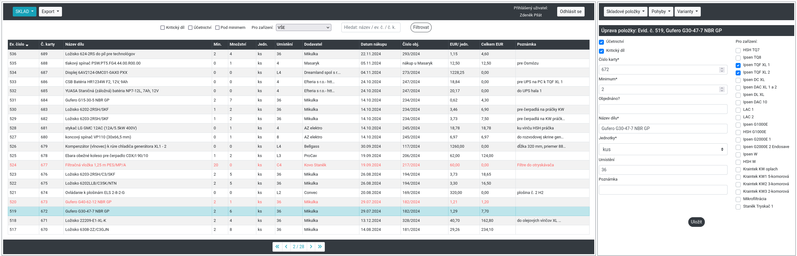
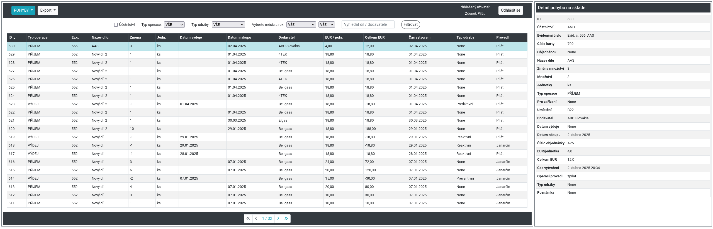
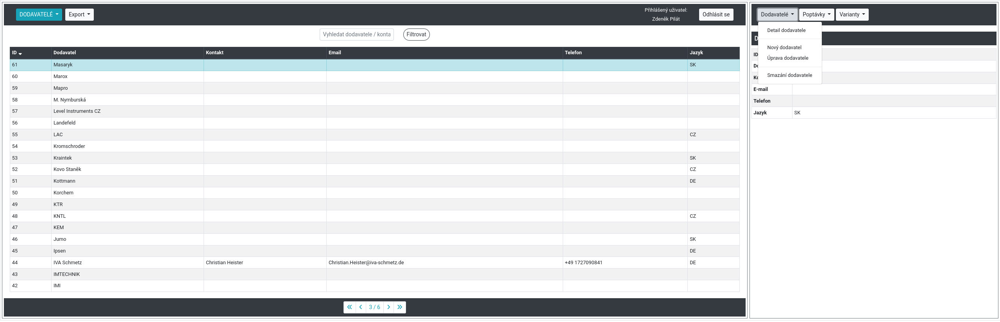

# Django Warehouse

**Django Warehouse** is a multi-user inventory management system for spare parts used in maintenance operations. It is designed for internal use in manufacturing or industrial environments, where detailed tracking of parts, suppliers, consumption, and stock movement is essential.

---

## ✨ Features

* Full CRUD operations for:

  * Spare parts (stock items)
  * Suppliers
  * Variants of parts per supplier
  * Inventory movements (receipts and dispatches)
  * Purchase requests
* Filterable list views with sorting and CSV export
* PDF reports with visual graphs of part usage and maintenance types
* Detailed logs of all inventory operations (using `django-simple-history`)
* Role-based access (Admin, Maintenance Manager, Editor, Read-only user)
* Responsive UI with Bootstrap for desktop and mobile
* Admin interface for quick data management

---

## 🧱 Tech Stack

* **Python 3.11**
* **Django 5.0**
* **SQLite**
* **Bootstrap 4 + crispy-forms**
* **Matplotlib** (for PDF graph generation)
* **Gunicorn + Whitenoise** (for production)
* **simple-history** (change tracking)
* **JavaScript** (only used lightly for split views like list + detail rendering)

---

## ⚙️ Installation

```bash
git clone https://github.com/zpilat/Django-warehouse.git
cd Django-warehouse
python3 -m venv venv
source venv/bin/activate
pip install -r requirements.txt

cp env.example .env  # configure secret key, debug and allowed hosts
python manage.py migrate
python manage.py createsuperuser
python manage.py runserver
```

---

## 📄 User Roles

* **Admin**: Full access to everything, including user management and logs
* **Maintenance Manager**: Can edit stock and view logs
* **Editor**: Can receive and dispatch items
* **Viewer**: Read-only access to data

---

## 🖼 Screenshots

### Stock list with filtering and highlighting


### Edit stock item



### Movement log detail (receipt/dispatch)



### Supplier detail



---

## 🔧 Example Usage

* Track how many parts were consumed per equipment in a selected year
* Identify critical parts with stock below minimum
* Export selected inventory logs to CSV or PDF

---

## 🚀 Deployment

* Uses SQLite by default (suitable for internal usage)
* Deployable via Gunicorn & Whitenoise
* Static files collected using `collectstatic`

---

## 🙅️ Requirements

* Python 3.11+
* See `requirements.txt` for full list (includes Django, crispy-forms, matplotlib, simple-history, etc.)

---

## 🔮 Future Work

* Build a full request workflow:

  * Create part requests ("poptávky") per supplier
  * Convert approved requests into purchase orders
  * Maintain a status flow: Requested → Awaiting Approval → Ordered → Received
  * Improve traceability of purchase lifecycle with audit logs and filtering options

---

## ✍️ Author

Created by [zpilat](https://github.com/zpilat) to support real maintenance operations in a Slovak manufacturing company.

---

## 📅 License

Licensed under [GNU GPL v3](LICENSE.txt)

---

> **Note:** This project requires basic knowledge of Python, Django, HTML, and Bootstrap. JavaScript is only used for enhancing some interactions like list+detail display split.
